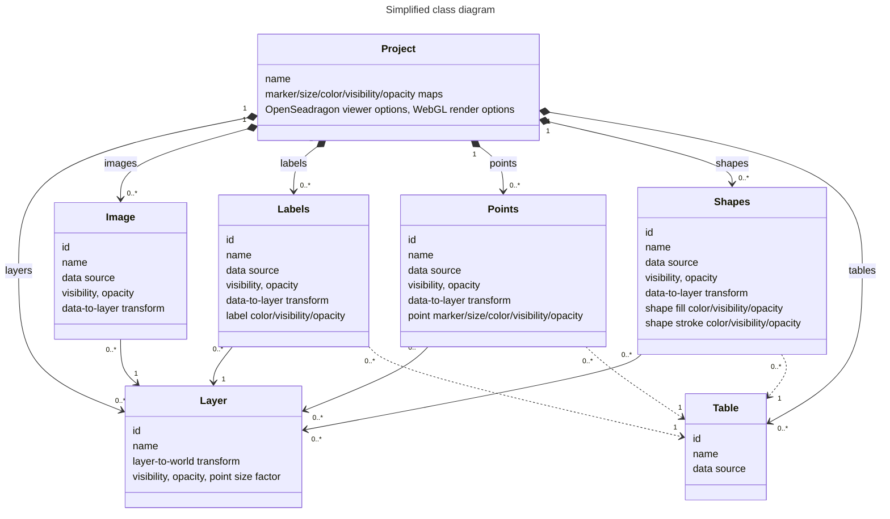

# Data model

A single **_Project_** can hold multiple rendered data objects (**_Images_**, **_Labels_**, **_Points_**, **_Shapes_**).

Each rendered data object can be shown on one or more **_Layers_**; a single item (e.g. point, shape) is never shown on more than one layer.

Rendered data objects representing multi-item data (_Labels_, _Points_, _Shapes_) can link to **_Table_** columns for item configuration.

The following simplified class diagram outlines this conceptual model, ignoring any functions/methods and inheritance structures.

