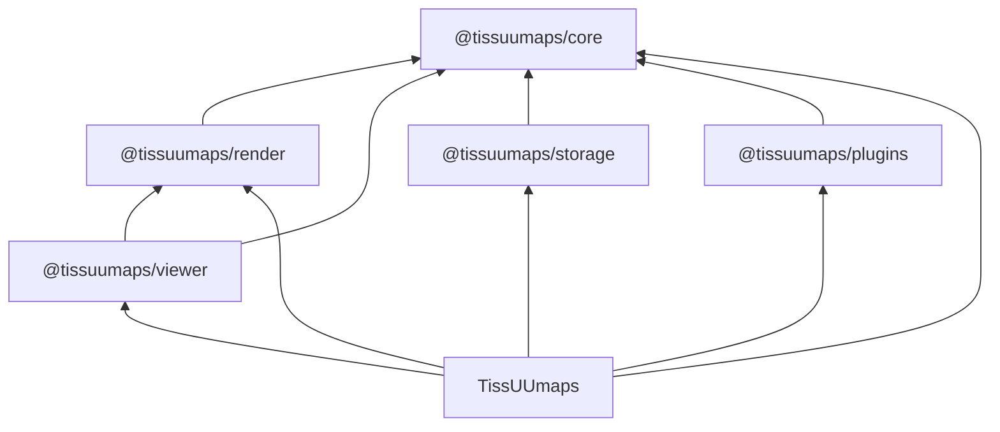

# Code architecture

This project is structured as a pnpm monorepo as follows:

```
- apps
  - docs                 # User and developer documentation
  - tissuumaps           # The TissUUmaps React application
- packages
  - @tissuumaps-core     # The TissUUmaps JavaScript library (models, storage interfaces, types, utilities)
  - @tissuumaps-render   # Rendering backends (OpenSeadragon, WebGL, SVG)
  - @tissuumaps-storage  # Officially supported data providers
  - @tissuumaps-plugins  # Officially supported TissUUmaps plugins
  - @tissuumaps-viewer   # The TissUUmaps viewer (React component)
```

Each package's `exports` point at its build output in `dist` only, so that
published packages contain nothing monorepo-specific. During development,
packages are resolved to their TypeScript sources instead, via a private
`tissuumaps-development` export condition: `customConditions` in `tsconfig.base.json`
for TypeScript (and thus for editor navigation), and `resolve.conditions` /
`ssr.resolve.conditions` in the Vite configs for Vite and Vitest. Because no
consumer's bundler declares that condition, it is inert in published packages.

The Vite configs add that condition only when the mode is not `production`, so
that production builds go through each package's `exports` and `dist` — the very
graph that is published — instead of silently bypassing it. Production builds of
the application therefore require the packages to be built first, which the
topologically ordered `pnpm run build` takes care of.

The following diagram outlines the dependency structure among packages and the TissUUmaps application:



Packages declare their `@tissuumaps/*` dependencies as peer dependencies and externalize them in their Vite builds; only the application bundles them.

## @tissuumaps/core

### Model

Models are implemented using a factory pattern. Each entity `X` consists of four parts, all exported from the same module: a `RawX` interface describing the serialized form (with optional fields), an `X` type describing the in-memory form (in which those optional fields are required, defaulting to `xDefaults`), the `xDefaults` constant holding those defaults, and a `createX()` factory that converts a `RawX` into an `X`:

```ts
export const imageDefaults = { ... } as const satisfies Partial<RawImage>;
export interface RawImage { ... }
export type Image = { ... };
export function createImage(rawImage: RawImage): Image { ... }
```

Data sources are carried as authored: the model only guarantees the base `DataSource` shape (`type`, and optionally `source`). Provider-specific defaults are not part of the model; the responsible data provider applies them in `normalize()` (see below).

Most data model properties can be either "simple properties" or of a concrete `Config` type. Concrete `Config` types are union types of one or more of the specific `ConstantConfig` (single uniform value), `FromConfig` (reference to a table column holding values), `GroupByConfig` (reference to a categorical table column holding group names), or `RandomConfig` (pseudo-random value generation, drawn deterministically from the item ID and an optional `seed`) types. The active configuration source can be determined by the shared `source` property of the general `Config` type, or by checking type guards in the order listed here using `getActiveConfigSource`.

### Storage

The `storage` module defines the abstract data provider interfaces (`DataProvider`, `Data`, and their data type-specific variants). `Data` is specialized by what the data is: `ItemsData` for data that enumerates its items and addresses them by ID (points, shapes, tables) and `RasterData` for tiled, multi-resolution rasters (images, labels). `DataProvider` is specialized by the data source instead: `AnnotatedDataProvider` opens an `AnnotatedDataSource` (labels, points, shapes), whose items a referenced table may annotate, and receives that table's data in `load()`. A data provider (e.g. a specific points data provider) creates data accessors (e.g. for a point cloud), which give access to parts of the associated data (e.g. point coordinates for a specific dimension). Every data source carries a `type`, under which the responsible data provider is registered in the application state (`registerImageDataProvider(type, provider)` etc.) before data of that type can be accessed.

A data provider first `normalize()`s a data source, applying its defaults and normalizing its `source` with `SourceUtils.normalizeSource` (which resolves it against the project source and the open workspace into an absolute URL or a workspace-relative path), and then `load()`s the normalized data source into a `Data` accessor, resolving a workspace-relative path to a file handle with `SourceUtils.resolveSource`. Accessor functions starting with `load...` are asynchronous; those starting with `get...` are synchronous. Concrete implementations live in `@tissuumaps/storage`.

### Types

The `types` module holds the contracts shared between packages and the application: the state and action types of the four application stores (`types/stores`), the plugin contract (`Plugin`, `PluginRegistry`, `PluginStores` in `types/plugins`), and the OpenSeadragon and WebGL option types, along with generic array, geometry, interaction and callback types. `palettes.ts` holds the built-in color palettes.

### Utilities

Utilities are exclusively implemented as static classes.

## @tissuumaps/render

This package contains the rendering backends and exposes the core TissUUmaps rendering functionality as an imperative API. It does not depend on React and can be used independently of `@tissuumaps/viewer`. There are three backends: OpenSeadragon (images and labels), WebGL 2 (points and shapes), and an SVG overlay (interactive shape drawing).

**Contexts** wrap the underlying rendering technology and manage shared low-level state:

- `OpenSeadragonContext` wraps an `OpenSeadragon.Viewer`, managing viewer options, animation handlers, world bounds, and the (asynchronous, FIFO-ordered) addition/removal of `OpenSeadragon.TiledImage` instances.
- `WebGLContext` wraps a `WebGL2RenderingContext`, providing helpers for creating programs, buffers, and textures, as well as canvas resizing. Context loss and restoration are handled by `@tissuumaps/viewer`.

**Renderers** track the state of the objects currently displayed and reconcile changes in the application state (layers, objects, attribute maps) with the rendering context via a `synchronize()` method:

- `OpenSeadragonImageRenderer` and `OpenSeadragonLabelsRenderer` extend `OpenSeadragonRendererBase`, managing one `OpenSeadragon.TiledImage` per channel of each rendered object (preceded by a backdrop tiled image for additively blended objects). Each renderer owns an invisible _anchor_ tiled image spanning its world bounds; its tiled images directly follow the anchor, which preserves the z-ordering between renderers sharing a viewer. The layers and objects to render are set by the synchronous `setModel()`, which applies the properties that tiled images take directly - layer and object transform, visibility and opacity, plus channel visibility and opacity, and channel colors and contrast limits via the data transfers - to the existing tiled images right away, always reading them from the current model. `needsSynchronization()` tells whether the asynchronous `synchronize()` has to run: it does for a changed set or order of layers or objects (the draw order is the world-index order, which only a synchronization can change), a changed data source, and changed label configurations or edited group-to-value maps they reference; renames need neither. A synchronization that fails leaves the model unsynchronized, so that the next `setModel()` triggers another one.
- `WebGLPointsRenderer` loads individual point clouds into separate GPU buffers (one GPU buffer per point attribute), draws each point cloud in its own pass with its layer- and object-level properties (transform, point size factor, opacity and visibility) as uniforms, and tracks the state of the GPU buffers and their respective point clouds.
- `WebGLShapesRenderer` loads individual shape clouds into separate GPU data textures, draws each shape cloud in its own pass with its layer- and object-level properties (transform, opacity and visibility) as uniforms, and tracks the state of the GPU data textures and their respective shape clouds.

  Both WebGL renderers extend `WebGLRendererBase` and expose `setModel()`, `needsSynchronization()`, `synchronize()` and `draw()` methods, plus the viewport and the render options as plain fields that the viewer assigns before redrawing. The layers and objects to render are set by the synchronous `setModel()`; `needsSynchronization()` tells whether the asynchronous `synchronize()` has to run for them, by comparing the model and the render options a synchronization depends on against those the last synchronization was based on: everything the renderers draw from a uniform is read from the current model on every draw, so changing a layer or object transform, opacity, visibility, point size factor or draw order takes effect on the next draw, without a reconciliation and without cancelling one that is in flight. The base class loads the objects of each layer, derives the draw order from the model on every draw, matches the rendered objects to the objects of the next synchronization (by layer, object, items and data source), runs the synchronization itself in two passes (prepare every object, then upload them one by one) and computes the layer/object opacity factor; the renderers own the GPU resources and implement the preparation, creation and update of one object, resolving the per-item properties and deciding which resources have to be rebuilt. Like the OpenSeadragon renderers, they take the inputs of a synchronization (tables, group-to-value maps and data loaders) as one context object, and a synchronization that fails leaves the model unsynchronized, so that the next `setModel()` triggers another one.

**Data transfers** recolor tiled images whose tiles carry values rather than colors: channels of image data implementing `getTileData()` (scaled between their contrast limits and multiplied with the channel color, see [Rendering](./rendering.md#images)) and label IDs (looked up in a per-object color table, with visibility and opacity folded into alpha). A `DataTransfer` is a `getTileData`/`transferValues` pair installed via `OpenSeadragonContext.updateTiledImageDataTransfer` and applied in a `tile-invalidated` handler. Transfers are kept per tile source, which also covers the navigator, and are compared by identity, so tiles are only recolored when the transfer changes.

**Resolvers** (`ColorResolver`, `SizeResolver`, `MarkerResolver`, `OpacityResolver`, `VisibilityResolver`) translate the model's `Config` types (constant, from-column, group-by, random) into per-item numeric values written into typed arrays for upload to the GPU. Each resolver also has a synchronous single-item counterpart (`resolve...WithoutTable`) that resolves an ID without loading any table data - constant and random sources exactly, from-column and group-by sources to the default value - which the labels renderer uses for labels that are not known up front (see [Rendering](./rendering.md#labels)), and a `resolveConstant...` counterpart that returns the one packed value of a constant configuration, which the points renderer supplies as a generic vertex attribute instead of a buffer (see [Rendering](./rendering.md#points)). The shapes renderer uses only the color, opacity and visibility resolvers.

`WebGLShapesRasterizer` constructs scanline data (edge lists and occupancy masks) on the CPU for the shapes fragment shader (see [Rendering](./rendering.md)). `SVGController` manages an SVG overlay for interactive shape drawing (rectangle, polygon, and freehand modes).

The package exports only the two contexts, the four renderers and `SVGController`; base classes, resolvers, the rasterizer and the `OpenSeadragonUtils`/`WebGLUtils` helper classes are internal. Table rows are looked up by item ID through `TableUtils` from `@tissuumaps/core`, both by the resolvers and by the renderers' per-item layer assignment; the map from ID to row is built at most once per table, and not at all when the IDs to look up are the table's own.

## @tissuumaps/storage

A data provider implementation consists of a concrete `DataSource` type with its `...DataSourceType` constant (the registration key), a concrete `DataProvider`, whose `load()` method takes the normalized data source and returns a concrete `Data` accessor, and that accessor, laid out as `XDataSource.ts`, `XDataProvider.ts` and `XData.ts`.

Each data provider has its own dedicated directory and is separately exported in the `package.json` and `vite.config.ts` files: `ome-zarr` and `openseadragon` (images), `table` (points backed by a table), `geojson` (shapes), `csv` and `parquet` (tables).

Heavy parsing and decoding runs off the main thread: Parquet and GeoJSON in dedicated web workers (`parquet.worker.ts`, `geojson.worker.ts`, inlined into the bundle), CSV via PapaParse's worker mode.

Format metadata belongs in the data provider: channel count, names, colors and contrast limits come from the file, not from the viewer. How the provider reads it is up to it. `OMEZarrImageDataProvider` goes through `OMEZarrTileSource`, `TIFFImageDataProvider` parses the IFDs itself.

## @tissuumaps/plugins

Each plugin has its own dedicated directory and is separately exported in the `package.json` and `vite.config.ts` files. The plugin contract itself lives in `@tissuumaps/core` (see [Plugins](./plugins.md)).

## @tissuumaps/viewer

The TissUUmaps `Viewer` component uses an adapter pattern facilitated by the `ViewerAdapter` interface, which decouples rendering from any particular application state management. It makes use of custom hooks that each encapsulate one rendering backend from `@tissuumaps/render` (separation of concerns): `useOpenSeadragon` (image and labels renderers), `useWebGL` (points and shapes renderers, including WebGL context loss and restoration), and `useSVG` (interactive drawing overlay). The WebGL canvas element and the SVG overlay element are appended as children to the `viewer.canvas` div element (child of the `viewer.container` div element, parent of the `viewer.drawer.canvas` canvas element) to allow for proper compositioning, where `viewer` is the `OpenSeadragon.Viewer` instance. The WebGL renderers' bounds are fed back into the OpenSeadragon world bounds, so that points and shapes count towards the navigable area.

The package exports `Viewer`, `ViewerAdapter`, and `ViewerControl`/`ViewerControlAnchor` for overlaying controls on the viewer. Internally, the active `OpenSeadragonContext` is exposed to descendant components via a React context (`OpenSeadragonContextProvider`), which is not part of the public API. The package is styling-agnostic and forwards `className` verbatim.

## TissUUmaps (tissuumaps)

In the TissUUmaps React app, absolute (`@/`) imports are used for imports across the source tree (e.g. `@/stores/project`, `@/components/ui/input`), while relative (`./`) imports are used within the same folder. There are no barrel files (`index.ts` re-exporting a folder's contents): the module that defines something is imported directly.

### App

`bootstrap` starts up the parts of the application that live outside of React, in this order: the built-in data providers are registered (`data/providers.ts`), the data caches are started, the plugin registry is started and exposed as `window.tissuumaps` (`plugins.ts`), loading of the project is _started_ — from the URL given in the `project` GET parameter, or from `project.json` if that parameter is absent or empty — and finally a `tissuumaps-loaded` event is dispatched on `window` (`events.ts`), after which plugins register themselves (see [Plugins](./plugins.md)); there are no plugins known to the application ahead of time. `bootstrap` returns a teardown function that cancels the project load and stops the registry and the caches, in that order; it is invoked on hot module replacement.

`App` lays out the built-in panels and the plugin panels (`usePluginPanels`) with Dockview, wrapped in the `DialogProvider`.

### Project I/O

`data/io/project.ts` loads a project into the stores (`loadProject`, `loadProjectFromURL`, `loadProjectFromFile`), serializes it back (`saveProject`, `saveProjectToJSON`, `saveAndDownloadProjectToJSON`), and keeps the `project` GET parameter in sync with the loaded project (`setProjectURLParam`, `clearProjectURLParam`).

### Plugin registry

`plugins.ts` owns the plugin lifecycle described on the [Plugins](./plugins.md) page. It is the only writer of the app store's `plugins`, where it keeps just each plugin's name and the container element of its user interface, so that Immer never freezes anything the plugin owns; the unmount and teardown callbacks are kept in a module-level map. `startPluginRegistry()` returns a teardown that unregisters all plugins.

### Hooks

Where possible and useful, React `useEffect` and `useCallback` hooks are encapsulated using custom hooks. Generic, feature-independent hooks live in `src/hooks` (e.g. `useControlled`, the per-type data hooks `useImageData`, `useTableData`, ... in `useData.ts`); feature-specific hooks are colocated in the feature folder they serve.

### Components

The user interface is built primarily using TailwindCSS, shadcn/ui, Base UI components, and the Dockview layout manager.

Components are structured as follows:

- `common` - custom low-level components that are commonly reused throughout the codebase
- `dialogs` - the dialog provider and context, and the alert, confirm and prompt dialogs
- `panels` - high-level UI building blocks (layout components) that are used as Dockview panels
- `ui` - shadcn/ui components, adapted to the application as needed (be careful when updating!)
- `widgets` - independent high-level components (e.g. configuration widgets) used across panels; the JSON Forms-based data source configuration forms live under `widgets/DataSourceWidget`

A feature component lives in a PascalCase folder named after the component (e.g. `components/panels/ImagesPanel`), with an `index.tsx` that _is_ the component (not a re-export). Everything that belongs to the feature sits next to it as flat files named by role, e.g. `hooks.ts`, `adapter.ts`, `category.ts`, sub-components such as `ImageSettingsWidget.tsx`, and feature hooks such as `useLabelsAnnotationsWidget.tsx`; a sub-feature of its own (e.g. `ProjectPanel/LayersWidget`) is a nested PascalCase folder following the same rule. There are no `types.ts`/`utils.ts` grab-bags. Anything with behavior (dialogs, providers, widgets, panels) follows this rule, even if it sits right next to `ui`. Only `ui` and `common` consist of flat, kebab-case single files (e.g. `ui/button.tsx`), as they are shadcn-style wrappers over `@base-ui/react`.

A React context is split into two files: `context.ts` holds the context object and its hook (`createContext`/`useContext` only), and `ContextProvider.tsx` holds the provider component, so that the hook can be imported without pulling in the provider's dependencies.

### State management

Four separate Zustand vanilla stores are used, one per file in `src/stores`, all typed in `@tissuumaps/core` (`types/stores`) so that plugins can consume them:

- `appStore` - transient application state: workspace, interaction mode, registered data providers and plugins
- `dataStore` - derived state: a data reference (`DataRef`) per project object, reconciled by the data caches (see below); treat as read-only
- `projectStore` - the loaded project (layers, images, labels, points, shapes, tables, maps, render options)
- `settingsStore` - user settings, persisted across sessions

Components subscribe with one narrow selector per field (e.g. `useProjectStore((s) => s.name)`) rather than selecting whole objects, so that they only re-render when the value they use changes.

All stores use the `devtools` middleware in development builds; `settingsStore` additionally uses the `persist` middleware. The immer middleware is used to perform immutable updates, with support for Maps and Sets enabled (`enableMapSet()` runs at module scope in `stores/zustand.ts`, which every store module imports, as stores are created - and rehydrated, in the case of `settingsStore` - while their module is being evaluated). Because immer rejects a recipe that both returns a value and mutates its draft, store actions must use a block body (`set((draft) => { draft.x = y; })`), never an expression body.

### Data caches

Loading and unloading of data is not driven by imperative actions. Instead, the caches in `data/cache` own every opened `Data` instance and publish their state to `dataStore`: there is one cache per data type, `tableDataCache` and `imageDataCache` (`DataCache`) as well as `labelsDataCache`, `pointsDataCache` and `shapesDataCache` (`AnnotatedDataCache`, which additionally resolves the table referenced by its data source).

Two separate mechanisms drive the caches:

- **Loading happens on demand**: `DataCache.load()` creates the cache entry for an object if necessary and subscribes to its ongoing load. Renderers call it through the per-type loaders of `useDataLoader` (`useImageDataLoader`, `useTableDataLoader`, ...). Components use the per-type hooks of `useData` instead (`useImageData`, `useTableData`, ...), which claim the data for as long as the component is mounted but read it back from `dataStore` rather than holding on to it themselves — so that a component never keeps using data whose entry the cache has meanwhile discarded. A load that all of its callers have aborted is cancelled again, and its entry discarded (see below).
- **Unloading is reconciled from state**: `startDataCaches()` (called from `bootstrap`) subscribes to `appStore` and `projectStore`, and every change re-runs `retainOnly()` on those caches whose inputs actually changed (the workspace, the project source, the registered data providers, or the project's objects). `retainOnly()` keeps entries that are still referenced and whose dependencies are unchanged, destroys all others, and never creates one. An entry that all of its objects have left is destroyed too: objects that resolve to its key but have not loaded it yet do not reference it, so nothing would ever reach it again.

The caches are implemented as follows:

- Objects are grouped by an **entry key**, the deterministic stringification (`JSONUtils.stringify(..., { stable: true })`) of their data source after the data provider has applied its defaults and normalized its `source` (`DataProvider.normalize`). Objects whose data sources normalize to the same value therefore share one cache entry, and its data is loaded only once. Resolution is memoized per data source object in a `WeakMap`, keyed on the responsible data provider, the workspace and the project source - the three inputs of normalization. The project source is not an entry dependency of its own: it only reaches an entry through the normalized data source, and hence through the entry key. Normalization must not fail reconciliation, so a data source whose `normalize()` throws keeps its authored form for the purpose of the entry key, and the error surfaces as the load failure of its entry.
- Each entry records the **entry dependencies** it was created with (`makeEntryDependencies`): the data provider, the workspace (only for data sources whose normalized `source` is a workspace-relative path, so remote data sources are unaffected by workspace changes), and for annotated data the referenced table's load operation. An entry is reused only while those are unchanged, otherwise it is destroyed and recreated - with the objects of the destroyed entry carried over, since they all resolve to the recreated one as well, and would otherwise be left pointing at data that has just been destroyed. Creating an annotated data entry hence also creates the referenced table's entry, while reconciliation merely _peeks_ at existing table entries (the `peek` option) rather than creating them.
- Entry state is published per object as a `DataRef`, which is `loading` (with optional progress), `loaded` or `error`, and which also carries the entry's `promise`. The `onObjectDataRefsChanged` callback writes it into `dataStore`, while `onObjectDataRefsRemoved` reports the objects of an entry that was discarded because its load had been abandoned, which removes their data ref again. Entries destroyed by `retainOnly()` are not reported that way, since its caller reconciles the store from its return value instead.
- Concurrent loads of one entry share a single `SharedOperation`: the underlying operation runs once and progress is fanned out to all of its subscribers. The cache merely _observes_ the operation (`observe()`) to publish its progress and outcome, rather than subscribing to it, so that it does not keep an unwanted load alive. Only `load()` callers subscribe: once the last of them has aborted, the operation is abandoned — it is aborted, and its entry is discarded along with its data refs, so that a later `load()` starts over.
- A load that _fails_ is treated differently from one that is abandoned: the failure is kept and not retried, until the entry is destroyed or its dependencies change (see above). Only genuine failures are cached this way; an abandoned load leaves nothing behind.
- Annotated data entries subscribe to the load operation of their referenced table for the duration of their own load (`makeDataProviderLoadOptions`), and hand that subscription to the data provider as its `tableDataPromise`. A table is therefore kept loading for exactly as long as some annotated data load or some other consumer needs it: the last consumer of a table going away does not cancel a table load that an annotated data load still depends on, and abandoning such a load releases its claim on the table again.
- Cached data is handed out wrapped (`data/cache/wrappers`): the wrapper makes `close()` a no-op, since the cache owns the lifetime, and exposes `destroy()` instead, which closes the underlying data. After `destroy()`, the wrapper refuses all access to the destroyed data — accessing it throws, and the methods that deduplicate through a `SharedOperation` reject rather than starting a new one — so that a consumer still holding on to it fails loudly instead of reading data whose resources have already been released. The table, points and shapes wrappers also deduplicate concurrent `load...` calls per argument via `SharedOperation`, abort them on `destroy()`, and — unlike entries — do retry a failed one on the next call, since here the operation, not the data source, is what failed.
- The public API of `DataCache` consists of `load()` and `retainOnly()` only. Subclasses adapt its behavior through the protected `makeEntryDependencies()`, `resolveDataProvider()` and `makeDataProviderLoadOptions()` hooks, and reach into another cache's entries through the protected _static_ `DataCache.getEntry()` — static because protected instance members are not accessible through a reference typed as the base class, as is the case for the `tableDataCache` held by an `AnnotatedDataCache`.

## Documentation (docs)

The documentation is based on Docusaurus and published to GitHub Pages using GitHub Actions. The API documentation for packages is generated by TypeDoc via `docusaurus-plugin-typedoc` and `typedoc-plugin-markdown`. Diagrams are powered by Mermaid.
