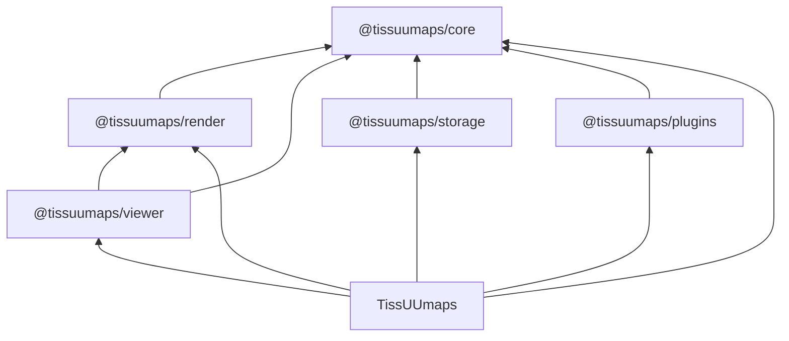

# Code architecture

This project is structured as a pnpm monorepo as follows:

```
- apps
  - docs                 # User and developer documentation
  - tissuumaps           # The TissUUmaps React application
- packages
  - @tissuumaps-core     # The TissUUmaps JavaScript library (models, storage interfaces, utilities)
  - @tissuumaps-render   # Rendering backends (OpenSeadragon, WebGL, SVG)
  - @tissuumaps-storage  # Officially supported data providers
  - @tissuumaps-plugins  # Officially supported TissUUmaps plugins
  - @tissuumaps-viewer   # The TissUUmaps viewer (React component)
```

Each package's `exports` point at its build output in `dist` only, so that
published packages contain nothing monorepo-specific. During development,
packages are resolved to their TypeScript sources instead, via a private
`tissuumaps-development` export condition: `customConditions` in `tsconfig.base.json`
for TypeScript (and thus for editor navigation), and `resolve.conditions` /
`ssr.resolve.conditions` in the Vite configs for Vite and Vitest. Because no
consumer's bundler declares that condition, it is inert in published packages.

The Vite configs add that condition only when the mode is not `production`, so
that production builds go through each package's `exports` and `dist` — the very
graph that is published — instead of silently bypassing it. Production builds of
the application therefore require the packages to be built first, which the
topologically ordered `pnpm run build` takes care of.

The following diagram outlines the dependency structure among packages and the TissUUmaps application:



## @tissuumaps/core

### Model

Models are implemented using a factory pattern. For each `RawModel` there exists a derived `Model` type in which optional fields are replaced by required fields defaulting to `modelDefaults`. A corresponding `createModel()` function can be used to convert a `RawModel` into a `Model`.

Most data model properties can be either "simple properties" or of a concrete `Config` type. Concrete `Config` types are union types of one or more of the specific `ConstantConfig` (single uniform value), `FromConfig` (reference to a table column holding values), `GroupByConfig` (reference to a categorical table column holding group names), or `RandomConfig` (pseudo-random value generation) types. The active configuration source can be determined by the shared `source` property of the general `Config` type, or by checking type guards in the order listed here using `getActiveConfigSource`.

### Storage

The `storage` module defines the abstract data provider interfaces (`DataProvider`, `Data`, and their data type-specific variants). A data provider (e.g. a specific points data provider) offers functionality for creating data accessors (e.g. for a point cloud), which can be used to access parts of the associated data (e.g. point coordinates for a specific dimension). They have a unique `type` and need to be registered in the application state before attempting to access data of that type. All data accessor functions starting with `load...` are asynchronous. Concrete implementations live in `@tissuumaps/storage`.

### Utilities

Utilities are exclusively implemented as static classes.

## @tissuumaps/render

This package contains the rendering backends and exposes the core TissUUmaps rendering functionality as an imperative API. It does not depend on React and can be used independently of `@tissuumaps/viewer`. There are three backends: OpenSeadragon (images and labels), WebGL 2 (points and shapes), and an SVG overlay (interactive shape drawing).

**Contexts** wrap the underlying rendering technology and manage shared low-level state:

- `OpenSeadragonContext` wraps an `OpenSeadragon.Viewer`, managing viewer options, animation handlers, world bounds, and the (asynchronous, FIFO-ordered) addition/removal of `OpenSeadragon.TiledImage` instances.
- `WebGLContext` wraps a `WebGL2RenderingContext`, providing helpers for creating programs, buffers, and textures, as well as canvas resizing and context-loss/restoration handling.

**Renderers** track the state of the objects currently displayed and reconcile changes in the application state (layers, objects, attribute maps) with the rendering context via a `synchronize()` method:

- `OpenSeadragonImageRenderer` and `OpenSeadragonLabelsRenderer` extend `OpenSeadragonRendererBase`, managing one `OpenSeadragon.TiledImage` per rendered object, anchored below a dummy tiled image to preserve z-ordering.
- `WebGLPointsRenderer` loads all point clouds into a single flat GPU buffer (one GPU buffer per point attribute) and tracks the state of the GPU buffer slices and their respective point clouds.
- `WebGLShapesRenderer` loads individual shape clouds into separate GPU data textures and tracks the state of the GPU data textures and their respective shape clouds.

  Both WebGL renderers extend `WebGLRendererBase` and expose `synchronize()` and `draw()` methods.

**Resolvers** (`ColorResolver`, `SizeResolver`, `MarkerResolver`, `OpacityResolver`, `VisibilityResolver`, all extending `ResolverBase`) translate the model's `Config` types (constant, from-column, group-by, random) into per-item numeric values written into typed arrays for upload to the GPU.

`WebGLShapesRasterizer` constructs scanline data (edge lists and occupancy masks) on the CPU for the shapes fragment shader (see [Rendering](./rendering.md)). `SVGController` manages an SVG overlay for interactive shape drawing (rectangle, polygon, and freehand modes).

## @tissuumaps/storage

A data provider implementation consists of a concrete `DataProvider`, whose `load()` method takes a concrete `DataSource` and returns a concrete `Data` accessor.

Each data provider has its own dedicated directory and is separately exported in the `package.json` and `vite.config.ts` files.

## @tissuumaps/plugins

Each plugin has its own dedicated directory and is separately exported in the `package.json` and `vite.config.ts` files.

## @tissuumaps/viewer

The TissUUmaps `Viewer` component uses an adapter pattern facilitated by the `ViewerAdapter` interface, which decouples rendering from any particular application state management. It makes use of custom hooks that each encapsulate one rendering backend from `@tissuumaps/render` (separation of concerns): `useOpenSeadragon` (image and labels renderers), `useWebGL` (points and shapes renderers), and `useSVG` (interactive drawing overlay). The WebGL canvas element and the SVG overlay element are appended as children to the `viewer.canvas` div element (child of the `viewer.container` div element, parent of the `viewer.drawer.canvas` canvas element) to allow for proper compositioning, where `viewer` is the `OpenSeadragon.Viewer` instance. The active `OpenSeadragonContext` is exposed to descendant components via a React context (`OpenSeadragonContextProvider`).

## TissUUmaps (tissuumaps)

In the TissUUmaps React app, absolute ("@/") imports are preferred over relative parent imports for cross-module imports, while relative imports remain acceptable within a module or feature directory.

### App

Upon startup (`bootstrap`), immer's Map/Set support is enabled, the built-in data providers are registered, the data caches are started, the plugin registry is exposed as `window.tissuumaps`, and loading of the project is _started_ — from the URL given in the `project` GET parameter, or from `project.json` if that parameter is absent or empty. A `tissuumaps-loaded` event is then dispatched on `window`, after which plugins register themselves (see [Plugins](./plugins.md)); there are no plugins known to the application ahead of time. `bootstrap` returns a teardown function, which is invoked on hot module replacement.

### Hooks

Where possible and useful, React `useEffect` and `useCallback` hooks are encapsulated using custom hooks.

### Components

The user interface is built primarily using TailwindCSS, shadcn/ui, Base UI components, and the Dockview layout manager.

Components are structured as follows:

- `common` - custom low-level components that are commonly reused throughout the codebase
- `panels` - high-level UI building blocks (layout components) that are used as Dockview panels
- `ui` - shadcn/ui components, adapted to the application as needed (be careful when updating!)
- `widgets` - independent high-level components (e.g. configuration widgets) used across panels; the JSON Forms-based data source configuration forms live under `widgets/DataSourceWidget`

### State management

Four separate Zustand stores are used, all typed in `@tissuumaps/core` (`types/stores`) so that plugins can consume them:

- `appStore` - transient application state: workspace, interaction mode, registered data providers and plugins
- `dataStore` - derived state: a data reference (`DataRef`) per project object, reconciled by the data caches (see below); treat as read-only
- `projectStore` - the loaded project (layers, images, labels, points, shapes, tables, maps, render options)
- `settingsStore` - user settings, persisted across sessions

The immer middleware is used to perform immutable updates, with support for Maps and Sets enabled (`enableMapSet()` runs at module scope in `stores/stores.ts`, which every store module imports, as stores are created - and rehydrated, in the case of `settingsStore` - while their module is being evaluated). Because immer rejects a recipe that both returns a value and mutates its draft, store actions must use a block body (`set((draft) => { draft.x = y; })`), never an expression body.

### Data caches

Loading and unloading of data is not driven by imperative actions. Instead, the caches in `data/cache` own every opened `Data` instance and publish their state to `dataStore`: there is one cache per data type, `tableDataCache` and `imageDataCache` (`DataCache`) as well as `labelsDataCache`, `pointsDataCache` and `shapesDataCache` (`ItemsDataCache`, which additionally resolves the table referenced by its data source).

Two separate mechanisms drive the caches:

- **Loading happens on demand**: `DataCache.load()` creates the cache entry for an object if necessary and subscribes to its ongoing load. Renderers call it through the per-type loaders of `useDataLoader` (`useImageDataLoader`, `useTableDataLoader`, ...). Components use the per-type hooks of `useData` instead (`useImageData`, `useTableData`, ...), which claim the data for as long as the component is mounted but read it back from `dataStore` rather than holding on to it themselves — so that a component never keeps using data whose entry the cache has meanwhile discarded. A load that all of its callers have aborted is cancelled again, and its entry discarded (see below).
- **Unloading is reconciled from state**: `startDataCaches()` (called from `bootstrap`) subscribes to `appStore` and `projectStore`, and every change re-runs `retainOnly()` on those caches whose inputs actually changed (the workspace, the project URL, the registered data providers, or the project's objects). `retainOnly()` keeps entries that are still referenced and whose dependencies are unchanged, destroys all others, and never creates one. An entry that all of its objects have left is destroyed too: objects that resolve to its key but have not loaded it yet do not reference it, so nothing would ever reach it again.

The caches are implemented as follows:

- Objects are grouped by an **entry key**, the deterministic stringification (`JSONUtils.stringify(..., { stable: true })`) of their data source after the data provider has applied its defaults and resolved its relative URLs (`DataProvider.normalize`). Objects whose data sources normalize to the same value therefore share one cache entry, and its data is loaded only once. Resolution is memoized per data source object in a `WeakMap`, keyed on the responsible data provider and the project URL - the two inputs of normalization. The project URL is not an entry dependency of its own: it only reaches an entry through the normalized data source, and hence through the entry key.
- Each entry records the **entry dependencies** it was created with (`makeEntryDependencies`): the data provider, the workspace (only for data sources with a `path`, so remote data sources are unaffected by workspace changes), and for items data the referenced table's load operation. An entry is reused only while those are unchanged, otherwise it is destroyed and recreated - with the objects of the destroyed entry carried over, since they all resolve to the recreated one as well, and would otherwise be left pointing at data that has just been destroyed. Creating an items data entry hence also creates the referenced table's entry, while reconciliation merely _peeks_ at existing table entries (the `peek` option) rather than creating them.
- Entry state is published per object as a `DataRef`, which is `loading` (with optional progress), `loaded` or `error`, and which also carries the entry's `promise`. The `onObjectDataRefsChanged` callback writes it into `dataStore`, while `onObjectDataRefsRemoved` reports the objects of an entry that was discarded because its load had been abandoned, which removes their data ref again. Entries destroyed by `retainOnly()` are not reported that way, since its caller reconciles the store from its return value instead.
- Concurrent loads of one entry share a single `SharedOperation`: the underlying operation runs once and progress is fanned out to all of its subscribers. The cache merely _observes_ the operation (`observe()`) to publish its progress and outcome, rather than subscribing to it, so that it does not keep an unwanted load alive. Only `load()` callers subscribe: once the last of them has aborted, the operation is abandoned — it is aborted, and its entry is discarded along with its data refs, so that a later `load()` starts over.
- A load that _fails_ is treated differently from one that is abandoned: the failure is kept and not retried, until the entry is destroyed or its dependencies change (see above). Only genuine failures are cached this way; an abandoned load leaves nothing behind.
- Items data entries subscribe to the load operation of their referenced table for the duration of their own load (`makeDataProviderOpenOptions`), and hand that subscription to the data provider as its `tableDataPromise`. A table is therefore kept loading for exactly as long as some items load or some other consumer needs it: the last consumer of a table going away does not cancel a table load that an items load still depends on, and abandoning an items load releases its claim on the table again.
- Cached data is handed out wrapped (`data/cache/wrappers`): the wrapper makes `close()` a no-op, since the cache owns the lifetime, and exposes `destroy()` instead, which closes the underlying data. After `destroy()`, the wrapper refuses all access to the destroyed data — accessing it throws, and the methods that deduplicate through a `SharedOperation` reject rather than starting a new one — so that a consumer still holding on to it fails loudly instead of reading data whose resources have already been released. Wrappers also deduplicate concurrent `load...` calls per argument via `SharedOperation`, abort them on `destroy()`, and — unlike entries — do retry a failed one on the next call, since here the operation, not the data source, is what failed.
- The public API of `DataCache` consists of `load()` and `retainOnly()` only. Subclasses adapt its behavior through the protected `makeEntryDependencies()`, `resolveDataProvider()` and `makeDataProviderOpenOptions()` hooks, and reach into another cache's entries through the protected _static_ `DataCache.getEntry()` — static because protected instance members are not accessible through a reference typed as the base class, as is the case for the `tableDataCache` held by an `ItemsDataCache`.

## Documentation (docs)

The documentation is based on Docusaurus and published to GitHub Pages using GitHub Actions. TypeDoc and typedoc-plugin-docusaurus are used to automatically build the API documentation for packages. Diagrams are powered by Mermaid.
