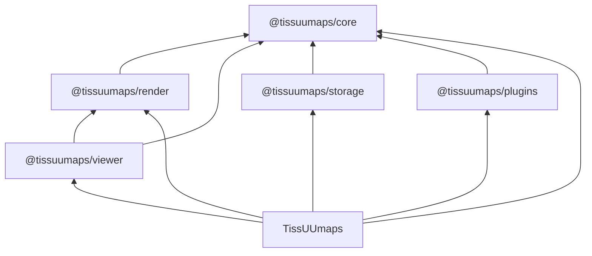

# Code architecture

This project is structured as a pnpm monorepo as follows:

```
- apps
  - docs                 # User and developer documentation
  - tissuumaps           # The TissUUmaps React application
- packages
  - @tissuumaps-core     # The TissUUmaps JavaScript library (models, storage interfaces, utilities)
  - @tissuumaps-render   # Rendering backends (OpenSeadragon, WebGL, SVG)
  - @tissuumaps-storage  # Officially supported data providers
  - @tissuumaps-plugins  # Officially supported TissUUmaps plugins
  - @tissuumaps-viewer   # The TissUUmaps viewer (React component)
```

The following diagram outlines the dependency structure among packages and the TissUUmaps application:



## @tissuumaps/core

### Model

Models are implemented using a factory pattern. For each `RawModel` there exists a derived `Model` type in which optional fields are replaced by required fields defaulting to `modelDefaults`. A corresponding `createModel()` function can be used to convert a `RawModel` into a `Model`.

Most data model properties can be either "simple properties" or of a concrete `Config` type. Concrete `Config` types are union types of one or more of the specific `ConstantConfig` (single uniform value), `FromConfig` (reference to a table column holding values), `GroupByConfig` (reference to a categorical table column holding group names), or `RandomConfig` (pseudo-random value generation) types. The active configuration source can be determined by the shared `source` property of the general `Config` type, or by checking type guards in the order listed here using `getActiveConfigSource`.

### Storage

The `storage` module defines the abstract data provider interfaces (`DataProvider`, `Data`, and their data type-specific variants). A data provider (e.g. a specific points data provider) offers functionality for creating data accessors (e.g. for a point cloud), which can be used to access parts of the associated data (e.g. point coordinates for a specific dimension). They have a unique `type` and need to be registered in the application state before attempting to access data of that type. All data accessor functions starting with `load...` are asynchronous. Concrete implementations live in `@tissuumaps/storage`.

### Utilities

Utilities are exclusively implemented as static classes.

## @tissuumaps/render

This package contains the rendering backends and exposes the core TissUUmaps rendering functionality as an imperative API. It does not depend on React and can be used independently of `@tissuumaps/viewer`. There are three backends: OpenSeadragon (images and labels), WebGL 2 (points and shapes), and an SVG overlay (interactive shape drawing).

**Contexts** wrap the underlying rendering technology and manage shared low-level state:

- `OpenSeadragonContext` wraps an `OpenSeadragon.Viewer`, managing viewer options, animation handlers, world bounds, and the (asynchronous, FIFO-ordered) addition/removal of `OpenSeadragon.TiledImage` instances.
- `WebGLContext` wraps a `WebGL2RenderingContext`, providing helpers for creating programs, buffers, and textures, as well as canvas resizing and context-loss/restoration handling.

**Renderers** track the state of the objects currently displayed and reconcile changes in the application state (layers, objects, attribute maps) with the rendering context via a `synchronize()` method:

- `OpenSeadragonImageRenderer` and `OpenSeadragonLabelsRenderer` extend `OpenSeadragonRendererBase`, managing one `OpenSeadragon.TiledImage` per rendered object, anchored below a dummy tiled image to preserve z-ordering.
- `WebGLPointsRenderer` loads all point clouds into a single flat GPU buffer (one GPU buffer per point attribute) and tracks the state of the GPU buffer slices and their respective point clouds.
- `WebGLShapesRenderer` loads individual shape clouds into separate GPU data textures and tracks the state of the GPU data textures and their respective shape clouds.

  Both WebGL renderers extend `WebGLRendererBase` and expose `synchronize()` and `draw()` methods.

**Resolvers** (`ColorResolver`, `SizeResolver`, `MarkerResolver`, `OpacityResolver`, `VisibilityResolver`, all extending `ResolverBase`) translate the model's `Config` types (constant, from-column, group-by, random) into per-item numeric values written into typed arrays for upload to the GPU.

`WebGLShapesRasterizer` constructs scanline data (edge lists and occupancy masks) on the CPU for the shapes fragment shader (see [Rendering](./rendering.md)). `SVGController` manages an SVG overlay for interactive shape drawing (rectangle, polygon, and freehand modes).

## @tissuumaps/storage

A data provider implementation consists of a concrete `DataProvider`, whose `open()` method takes a concrete `DataSource` and returns a concrete `Data` accessor.

Each data provider has its own dedicated directory and is separately exported in the `package.json` and `vite.config.ts` files.

## @tissuumaps/plugins

Each plugin has its own dedicated directory and is separately exported in the `package.json` and `vite.config.ts` files.

## @tissuumaps/viewer

The TissUUmaps `Viewer` component uses an adapter pattern facilitated by the `ViewerAdapter` interface, which decouples rendering from any particular application state management. It makes use of custom hooks that each encapsulate one rendering backend from `@tissuumaps/render` (separation of concerns): `useOpenSeadragon` (image and labels renderers), `useWebGL` (points and shapes renderers), and `useSVG` (interactive drawing overlay). The WebGL canvas element and the SVG overlay element are appended as children to the `viewer.canvas` div element (child of the `viewer.container` div element, parent of the `viewer.drawer.canvas` canvas element) to allow for proper compositioning, where `viewer` is the `OpenSeadragon.Viewer` instance. The active `OpenSeadragonContext` is exposed to descendant components via a React context (`OpenSeadragonContextProvider`).

## TissUUmaps (tissuumaps)

In the TissUUmaps React app, absolute ("@/") imports are preferred over relative parent imports for cross-module imports, while relative imports remain acceptable within a module or feature directory.

### App

Upon startup, all TissUUmaps plugins are initialized and the application state is initialized using a project file loaded from `project.json` (if available) or from the URL given in the `project` GET parameter.

### Hooks

Where possible and useful, React `useEffect` and `useCallback` hooks are enapsulated using custom hooks.

### Components

The user interface is built primarily using TailwindCSS, shadcn/ui, Base UI components, and the Dockview layout manager.

Components are structured as follows:

- `common` - custom low-level components that are commonly reused throughout the codebase
- `panels` - high-level UI building blocks (layout components) that are used as Dockview panels
- `ui` - shadcn/ui components, adapted to the application as needed (be careful when updating!)
- `widgets` - independent high-level components (e.g. configuration widgets) used across panels; the JSON Forms-based data source configuration forms live under `widgets/DataSourceWidget`

### State management

A single Zustand store is being used, which is distributed over several slices. The main slices are `app` (transient application state), `project` (persistent project information) and data type-specific slices that hold project data (transient in-memory data and persistent metadata). Data objects returned by data providers are exposed to the TissUUmaps `Viewer` component using custom data type-specific store adapters. The immer middleware is used to perform immutable updates, with support for Maps and Sets enabled. Asynchronous store actions are deduplicated based on the JSON-stringified function arguments.

## Documentation (docs)

The documentation is based on Docusaurus and published to GitHub Pages using GitHub Actions. TypeDoc and typedoc-plugin-docusaurus are used to automatically build the API documentation for packages. Diagrams are powered by Mermaid.
